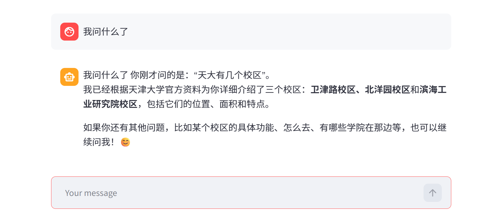
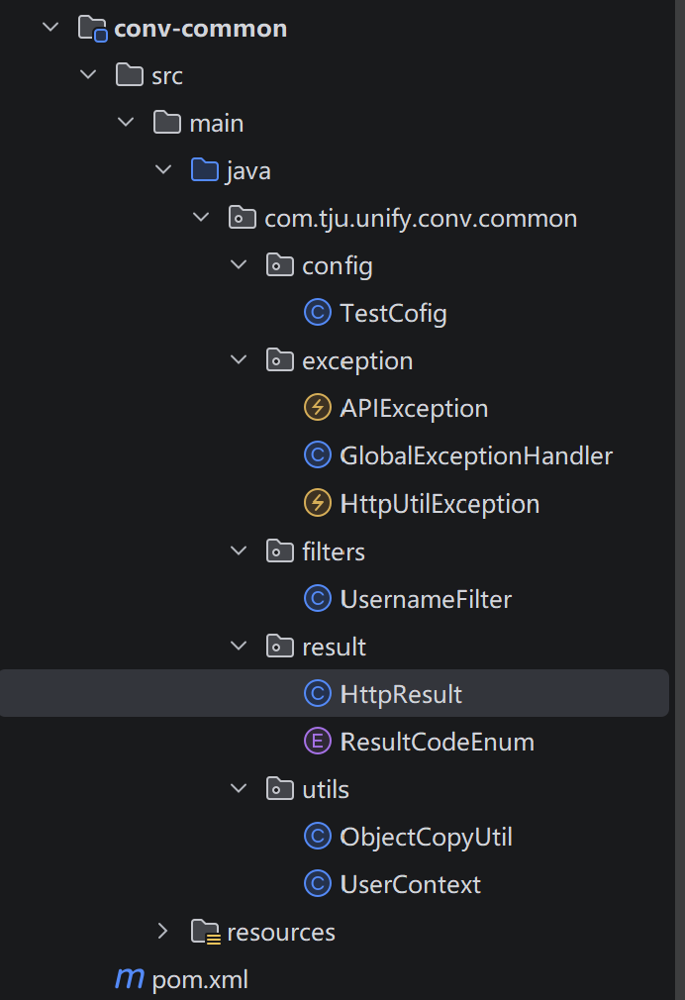

# tju-unify
## 2026.4.15进度

### 一 、智能体
1.完成基本框架搭建  

2.检索部分
  - 基础检索：Chroma + 向量相似度，支持 txt/pdf/csv 入库（rag/vectore_store.py）
  - 高级检索（rag/advanced_retrieval.py）：
    - MQE：多查询扩展，生成多条语义等价问句提高召回。
    - HyDE：假设文档嵌入，先生成假设答案再检索相似文档。
    - 扩展检索框架：MQE + HyDE 多路检索后合并去重、排序。
    

3.ReAct Agent  
- **作用：** 实现「推理 + 行动」循环：根据当前对话决定下一步是调用工具还是直接回答，支持多轮工具调用。
- **实现：** 基于 LangChain create_agent（LangGraph），模型 + 系统提示词 + 工具列表 + 中间件。
- **中间件（agent/tools/middleware.py）**：
  - monitor_tool：工具调用前后打日志，并可改写上下文（如 report 场景）。
  - log_before_model：每次调用模型前记录消息条数及简要内容。
  - report_prompt_switch：按上下文动态切换/注入报告相关 Prompt。
- **入口：** agent/react_agent.py 的 ReactAgent，对外提供 execute_stream(query) 流式输出。
  

**4.记忆功能**
- 保留最近 10 轮完整对话作为**滑动窗口**
- 更早历史自动压缩成**摘要记忆**
- 摘要记忆 + 最近 10 轮 + 当前待回答问题  
- **摘要记忆持久化：** 系统能够为每个 Streamlit 会话生成唯一的 session_id，并在启动时从磁盘
（默认为 data/conversation_memory/<session_id>.json）恢复历史摘要。每轮对话更新摘要后会
自动写回磁盘，从而实现跨页面刷新甚至服务重启的摘要记忆持久化能力。
- **运行时历史与 RAG 摘要集成：** 新增runtime_history.py 模块，利用 contextvars 保存当前
执行链路的完整对话历史。中间件在 before_model 阶段将本轮 state["messages"] 中的用户与助手消
息写入运行时历史，rag_summarize 工具调用时从中读取历史内容并传递给 rag.rag_summarize
(history=...)，确保摘要生成能够真正基于完整的对话上下文。（原始版本仅仅针对当前query做拓展）

  

5.未来规划
- 工具调用：调用后端其他接口，例如，当用户意图涉及“跑腿下单”“空教室查询”等操作类需求时，系统可自动调用对应后端API完成服务闭环，实现从信息咨询到业务办理的功能延伸。
- Fast API

### 二、二手交易市场  
- 商品列表 /sec（按分类、按「最新 / 热门」排序、分页）
- 详情 /getOne
- 浏览量 /click
- 发布 POST sec/issue
- 评论 POST sec/comment

- **未来规划：** 完善接口，加入服务注册Eureka、登录相关拦截与 JWT 配置

### 三、新闻推送
- HTTP 查询接口（列表/详情）
- 定时爬虫入库（WebMagic + MyBatis-Plus）模块的数据来源是定时爬虫 TjuNewsCrawlerTask（WebMagic），启动后按计划任务跑

### 四、校园电商平台微服务
- **订单模块**  
  - 根据id获取用户订单
  - 新增订单 
  - 根据商家和状态获取订单列表
  - 获取订单详情
  - 设置订单状态
  - 下单
  
- **商品模块**
  - 获取所有商品
  - 修改商品信息
  - 新增商品
  - 删除商品
  
- **购物车模块**
  - 向购物车添加商品
  - 获取用户在指定商家的购物车商品列表
  - 清空购物车，移除指定购物车商品

### 五、其它
- `conv-common` 公共模块，公共的依赖的引入，以及结果封装，异常的统一处理
- `conv-gateway` 网关，用于路由转发和鉴权  

### 五、团队贡献
- 高灿：电商的订单模块  **工作量：20%**
- 曾意：agent基础记忆功能与摘要记忆持久化 **工作量：20%**
- 杨晓越：电商的购物车模块 **工作量：20%**
- 戴茗静：公共模块与网关+电商的商品模块 **工作量：20%**
- 贾思韵：agent运行时历史与 RAG 摘要集成 **工作量：20%**

### 六、其他规划
- 本周内完成所有后端部分，并部署
- 下周开始做前端