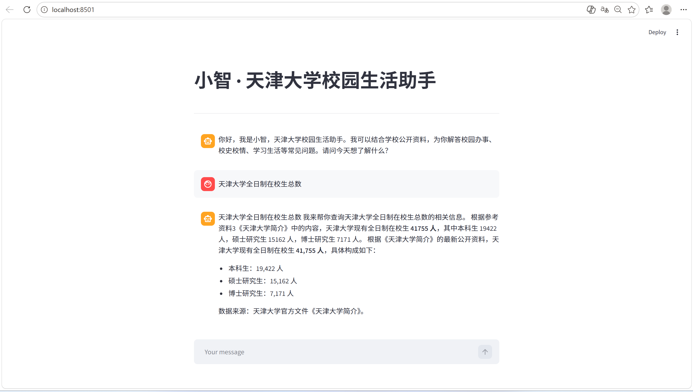

# tju-unify

---

        本项目是一个主要面向tju的校园生活多功能工具应用。前后端分离，后端采用微服务架构，后续可以对工具和应用进行拓展(添加微服务模块/接入网关)。

当前核心功能模块(*标识该功能为网关直接接入)：

- 校园智能体助手

- 二手交易平台

- 新闻推送

- 校园电商平台*
  
  该服务也是一个微服务架构的后端
  
  仓库：https://gitee.com/dai-mingjing/frontend-comprehension.git

---

# 进度

## 2026.4.15进度

### 一 、智能体

1.完成基本框架搭建  

2.检索部分

- 基础检索：Chroma + 向量相似度，支持 txt/pdf/csv 入库（rag/vectore_store.py）
- 高级检索（rag/advanced_retrieval.py）：
  - MQE：多查询扩展，生成多条语义等价问句提高召回。
  - HyDE：假设文档嵌入，先生成假设答案再检索相似文档。
  - 扩展检索框架：MQE + HyDE 多路检索后合并去重、排序。

3.ReAct Agent  

- **作用：** 实现「推理 + 行动」循环：根据当前对话决定下一步是调用工具还是直接回答，支持多轮工具调用。
- **实现：** 基于 LangChain create_agent（LangGraph），模型 + 系统提示词 + 工具列表 + 中间件。
- **中间件（agent/tools/middleware.py）**：
  - monitor_tool：工具调用前后打日志，并可改写上下文（如 report 场景）。
  - log_before_model：每次调用模型前记录消息条数及简要内容。
  - report_prompt_switch：按上下文动态切换/注入报告相关 Prompt。
- **入口：** agent/react_agent.py 的 ReactAgent，对外提供 execute_stream(query) 流式输出。
  

**4.记忆功能**

- 保留最近 10 轮完整对话作为**滑动窗口**
- 更早历史自动压缩成**摘要记忆**
- 摘要记忆 + 最近 10 轮 + 当前待回答问题  
- **摘要记忆持久化：** 系统能够为每个 Streamlit 会话生成唯一的 session_id，并在启动时从磁盘
  （默认为 data/conversation_memory/<session_id>.json）恢复历史摘要。每轮对话更新摘要后会
  自动写回磁盘，从而实现跨页面刷新甚至服务重启的摘要记忆持久化能力。
- **运行时历史与 RAG 摘要集成：** 新增runtime_history.py 模块，利用 contextvars 保存当前
  执行链路的完整对话历史。中间件在 before_model 阶段将本轮 state["messages"] 中的用户与助手消
  息写入运行时历史，rag_summarize 工具调用时从中读取历史内容并传递给 rag.rag_summarize
  (history=...)，确保摘要生成能够真正基于完整的对话上下文。（原始版本仅仅针对当前query做拓展）

  

5.未来规划

- 工具调用：调用后端其他接口，例如，当用户意图涉及“跑腿下单”“空教室查询”等操作类需求时，系统可自动调用对应后端API完成服务闭环，实现从信息咨询到业务办理的功能延伸。
- Fast API

### 二、二手交易市场

- 商品列表 /sec（按分类、按「最新 / 热门」排序、分页）

- 详情 /getOne

- 浏览量 /click

- 发布 POST sec/issue

- 评论 POST sec/comment

- **未来规划：** 完善接口，加入服务注册Eureka、登录相关拦截与 JWT 配置

### 三、新闻推送

- HTTP 查询接口（列表/详情）
- 定时爬虫入库（WebMagic + MyBatis-Plus）模块的数据来源是定时爬虫 TjuNewsCrawlerTask（WebMagic），启动后按计划任务跑

### 四、校园电商平台微服务

- **订单模块**  
  
  - 根据id获取用户订单
  - 新增订单 
  - 根据商家和状态获取订单列表
  - 获取订单详情
  - 设置订单状态
  - 下单

- **商品模块**
  
  - 获取所有商品
  - 修改商品信息
  - 新增商品
  - 删除商品

- **购物车模块**
  
  - 向购物车添加商品
  - 获取用户在指定商家的购物车商品列表
  - 清空购物车，移除指定购物车商品

### 五、其它

- `conv-common` 公共模块，公共的依赖的引入，以及结果封装，异常的统一处理

- `conv-gateway` 网关，用于路由转发和鉴权  
  
  

### 五、团队贡献

- 高灿：电商的订单模块  **工作量：20%**
- 曾意：agent基础记忆功能与摘要记忆持久化 **工作量：20%**
- 杨晓越：电商的购物车模块 **工作量：20%**
- 戴茗静：公共模块与网关+电商的商品模块 **工作量：20%**
- 贾思韵：agent运行时历史与 RAG 摘要集成 **工作量：20%**

### 六、其他规划

- 本周内完成所有后端部分，并部署
- 下周开始做前端

---

# 1 项目架构

## 1.1 目录结构

不同框架模块分开，总网关基于Spring实现

```
tju-unify/
├── docs/                  # 一些文档
├── tian-agent/            # 智能体源码
├── unify-conv/            # Spring部分后端 (包含整个应用网关)
│   ├── conv-api           # Feign 客户端模块
│   ├── conv-common        # 公共模块
│   ├── conv-news          # 新闻推送模块
│   ├── conv-gateway       # 应用网关
│   ├── conv-transaction   # 二手交易模块
│   ├── pom.xml            # 父工程依赖
│   └── sql                # 数据库建库sql文件
├── .gitignore
├── LICENSE
└── README.md
```

# 2 开发说明

## 2.1 Spring 部分后端

`unify-conv` ：基于Spring系列实现的均在这个模块下管理。主要管理：整个unify的网关(包括外接服务请求处理如电商平台)、新闻推送服务、二手平台服务、后续基于该框架的扩展服务  

### 2.1.1 结构

 `unify-conv` 为这部分的父工程，在这里做依赖版本管理等。  

整体按服务模块组织，feign客户端由各个服务自己管理  

现主要有以下模块：  

- `conv-common` 公共模块，其他服务依赖该模块，有一些公共的依赖已经引入  

- `conv-gateway` 网关，用于路由转发和鉴权  

- `conv-news` 新闻推送服务  

- `conv-transaction`  二手平台服务  

- 后续追加服务......  

### 2.1.2 一些说明

关于电商平台，目前直接调用饿了吧那边的接口  

**特别地在用户这一块**  

整个unify的用户管理直接与饿了吧那边同步，也就是unify的用户就是饿了吧的用户，共用一个数据库、一套鉴权逻辑。后续如果有时间的话就把两个分离一下，没有就算了  

**现在网关的鉴权与转发逻辑**  

### 2.1.3 加入新服务流程

**情况一：添加新服务模块实现**

1. 创建新 sprintboot 模块，模块名统一前缀 `conv-`  
   包路径前缀最好规范成 `com.tju.unify.conv.` + 模块名  
   服务名前缀最好是规范成 `unify-`  
   端口：路由7070  
   
   配置文件就直接参考已有服务(nacos、数据库之类的)  

2. 依赖部分：  
      必须引入公共模块，因为需要统一响应等规范；和服务发现 
   
   ```xml
   <dependency>  
       <groupId>com.tju.unify</groupId>       
       <artifactId>conv-common</artifactId>       
       <version>1.0.0-SNAPSHOT</version>   
   </dependency>   
   <dependency>        
       <groupId>com.alibaba.cloud</groupId>        
       <artifactId>spring-cloud-starter-alibaba-nacos-discovery</artifactId>   
   </dependency> 
   ```
   
   如果需要获取当前用户信息或者调用其他服务，需要引入feign客户端：
   
   ```xml
   <dependency>  
       <groupId>com.tju.unify</groupId>       
       <artifactId>conv-api</artifactId>       
       <version>1.0.0-SNAPSHOT</version>   
   </dependency>  
   ```
   
   接口文档相关的看着办：
   
   ```xml
   <dependency>  
        <groupId>org.springdoc</groupId>        
        <artifactId>springdoc-openapi-starter-webmvc-ui</artifactId>        
        <version>${springdoc-openapi.version}</version>   
   </dependency>  
   ```

3. 启动类注解，如：  
   
   ```java
   @SpringBootApplication
   @EnableDiscoveryClient // 启用服务发现
   @MapperScan("com.tju.unify.conv.news.mapper") //mapper包路径
   public class ConvNewsApplication {
   
       public static void main(String[] args) {
           SpringApplication.run(ConvNewsApplication.class,args);
       }
   }
   ```

4. 网关接入
   
   在网关的配置文件 `application.yml` 中：
   
   - `spring.cloud.gateway.routes` 添加路由规则
   
   - 对于不需要鉴权的接口，加入 `unify.auth.excludePaths`

5. 数据库暂时用bobchasm.cn服务器上部署的mysql，要新建数据库直接建就行，最好存下建库sql在路径`sql`下  
      然后把mybatis变成mybatis-plus了，基础增删改查可以不用写，然后我看新闻推送那里写了分页，可以改成使用mybatis-plus的更方便的分页  

**情况二：接入外部 api**

直接按情况一的4做

如果想要进行一些处理，可以新建一个模块作为一个包装微服务

### 2.1.4 服务间调用

引入`api` 模块的依赖

- 项目内部服务的接口
  
  在 `/conv-api/src/main/java/com/tju/unify/conv/api/client/inner`中添加微服务的Feign客户端，已经有了就往相应的客户端加接口

- 网关接入的接口
  
  可以在`unify-api` 模块的`src/main/java/com/tju/unify/conv/api/client/outer` 中写调用的逻辑，当然也可以直接在模块里写

# 3 智能体
